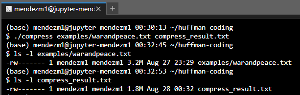

# Huffman Coding
This project implements the Huffman coding algorithm to compress and uncompress a given file of text using C++

## Technologies
The programs in this project were run using the following:
* G++ 9.3

## Setup
After cloning or forking the repository, you can run the program through the command line in the below manner:
1. You will want to `cd` into the repository
2. Compile the `compress.cpp` file along with all of the `cpp` helper files to use the compress portion of the Huffman Coding
   - An example of this would be `g++ compress.cpp helper_files/*.cpp -o compress`
       * It is recommend to name the executable created so you do not confuse yourself with the `uncompress` executable
3. Compile the `uncompress.cpp` file along with all of the `cpp` helper files to use the uncompress portion of the Huffman Coding
   - An example of this would be `g++ uncompress.cpp helper_files/*.cpp -o uncompress`
       * It is recommend to name the executable created so you do not confuse yourself with the `compress` executable

## Execution
Example text files have been given for you to use, but feel free to use your own if desired.

### Compress
To compress a text file, you will want to run the executable created when compiling the `compress.cpp` file mentioned above.
From there, enter the input file and desired name of output file as additional arguments when running the executable.
* The general format will be `./compress input_file output_file`
* An example of this will be `./compress warandpeace.txt compress_result.txt`

### Uncompress
To uncompress a text file, you will want to run the executable created when compiling the `uncompress.cpp` file mentioned above.
From there, enter the input file and desired name of output file as additional arguments when running the executable.
* The general format will be `./uncompress input_file output_file`
* An example of this will be `./uncompress compress_result.txt uncompress_result.txt`

## Output

